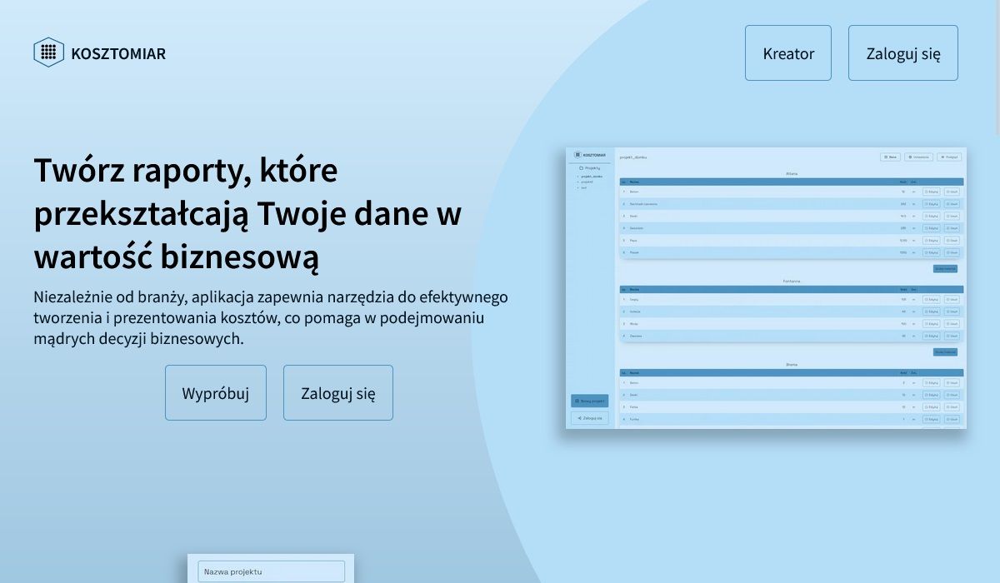
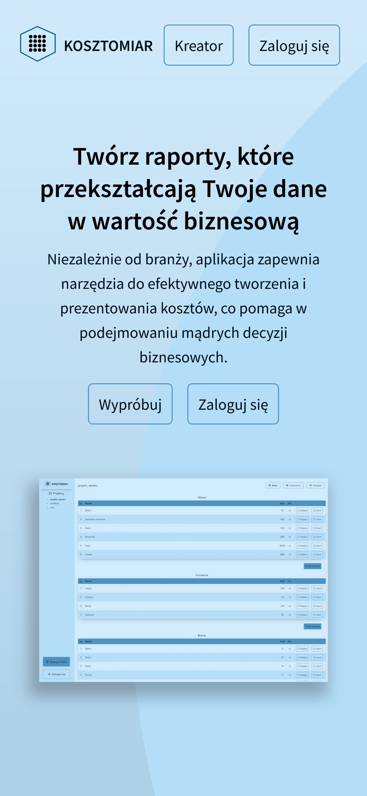
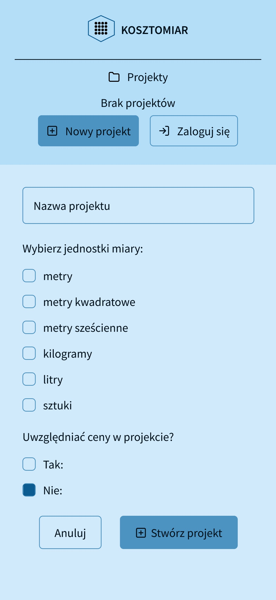
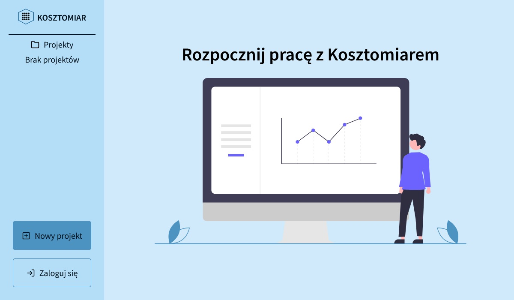

# Kosztomiar

Kosztomiar is an application that allows users to create bills of materials with prices and generate PDF files with cost estimates from them.

## Table of contents

- [Overview](#overview)
  - [Project description](#description)
  - [How to use](#how-to-use)
  - [Screenshot](#screenshot)
  - [Technology stack](#technology-stack)
  - [Further improvements](#further-improvements)
- [Author](#author)

## Overview

### Description

The application allows users both to use it without logging in and save data locally, and to create an account and store data in a MongoDB database. In addition, Kosztomiar's homepage acts as a landing page that presents the benefits of using this application. Currently works only in Polish language.

[Link to the application](https://kosztomiar.vercel.app/)

### How to use

#### Registration and login:

If you want to store your data and use the app on multiple devices, we recommend registering. If you don't want to create an account, you can use the app without logging in.

#### Adding estimate material:

After logging in or entering your data in the app, you can create a new project. Enter the name of the project, material units and required prices.

#### Generate cost estimate:

After adding a project and entering data, you can create a PDF file in the statement view. Download the PDF file to your computer.

#### Account management:

If you have an account, you can log in and access your password to change it.

### Screenshot

<!-- 

 -->

### Technology stack

- React
- TypeScript
- Next.js
- Module CSS
- MongoDB
- Jest

### Further improvements

Kosztomiar is a project in continuous development, and there are several opportunities for further enhancements:

#### File Structure Refinement:

Organize project files in a more structured manner.

#### Unit Testing:

Expand unit tests, following a consistent schema, like Given-When-Then, to ensure code quality and prevent errors.

#### Modal Fixes:

Improve the modal functionality to prevent keyboard navigation through elements in the background.

#### ARIA Enhancements:

Implement full ARIA (Accessible Rich Internet Applications) support to ensure accessibility for users relying on screen readers.

#### Support for Other Languages:

Add support for multiple languages, starting with English, to make the application accessible to a broader audience.

#### Cross-Browser Compatibility:

Adapt the application's appearance and behavior to work correctly in various web browsers, not limited to Chrome.

### Author

- Instagram - [@pawel.coder](https://www.instagram.com/pawel.coder/)
